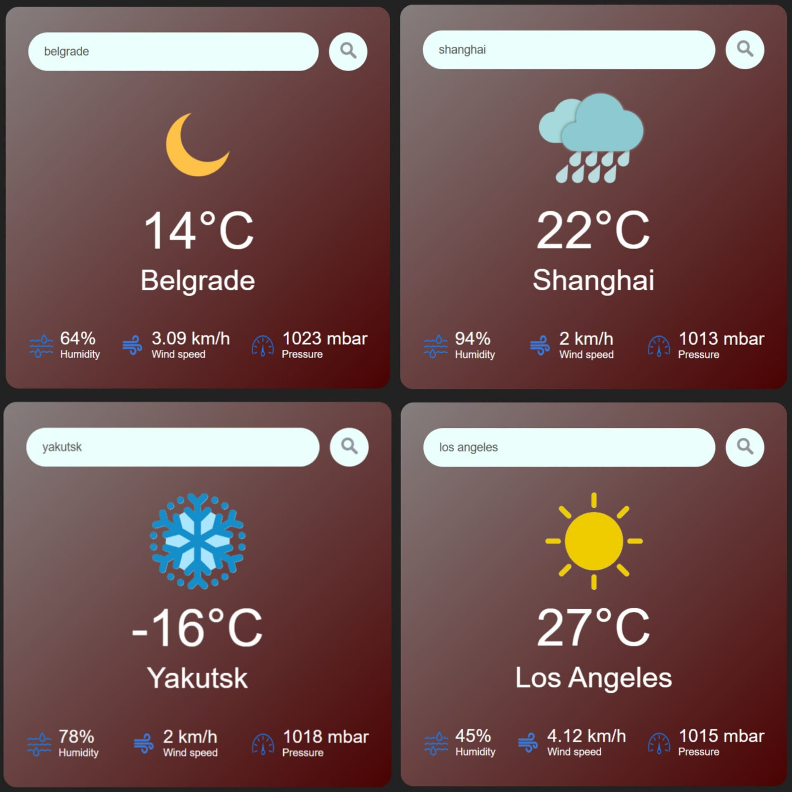

# Weather app
 **DESCRIPTION**  
--> Interactive web app which shows current weather parameters (temperature, humidity, wind speed, atmospheric pressure) of cities all around the world. Additionally, the application uses weather condition images to allow users to determine the current weather in that city (sunny, cloudy, rainy, etc.) based on visual representations. The images also indicate whether it is currently day or night in that city. This application uses the API provided by the famous OpenWeatherMap online service.  

**SCREENSHOTS**  
  

**TECHNOLOGIES AND TOOLS**  

| Technology        | Icon                                                                                           |
|-------------------|------------------------------------------------------------------------------------------------|
| HTML              |  |
| CSS               |   |
| JavaScript        |  |
| OpenWeather API   |  |
| Git / Git Bash    |  |
